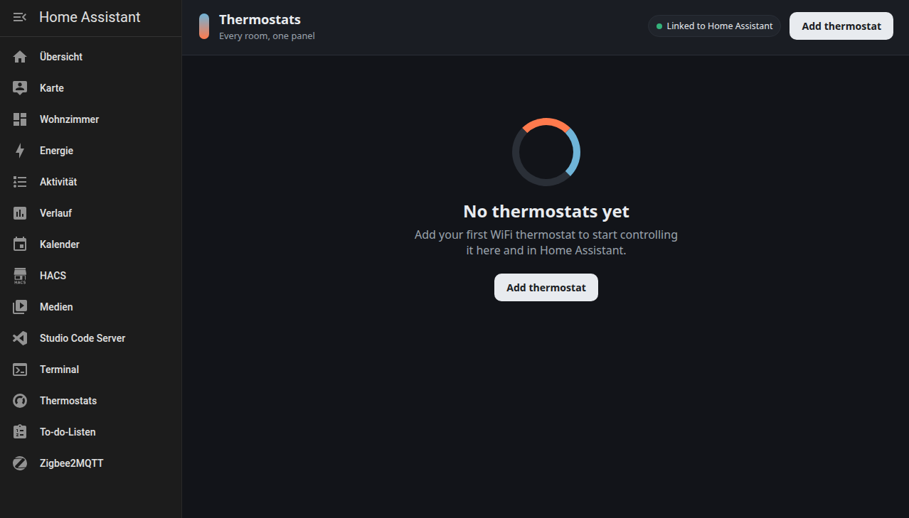

# WiFi Thermostat Manager

A Home Assistant add-on that lets you add, control and monitor **multiple WiFi
smart thermostats from a single dashboard**. Every thermostat you add is also
published to Home Assistant as a native `climate` entity over MQTT — so it shows
up automatically with a full thermostat card and works in automations, scripts
and dashboards, not just inside this add-on.

## What it does

- One control panel for all your thermostats (current temp, setpoint, mode,
  heating/idle state) shown as instrument-style dial cards.
- Add / edit / remove thermostats from the UI — no YAML editing.
- Auto-publishes each device to Home Assistant via **MQTT discovery**.
- Two-way control: changes made in Home Assistant flow back to the device, and
  changes made on the device show up here and in HA.
- Background polling keeps every device fresh.

## Supported devices

| Type | Use it for |
|------|------------|
| **Tuya (local)** | Moes, Beca, Avatto, BHT-002 / BAC-002 and most cheap white-label WiFi thermostats. Controlled locally over the LAN — no cloud — using the device ID, local key and IP. |
| **Generic REST** | Any thermostat exposing a local HTTP/JSON API (custom/DIY/ESP firmware). Fully configurable URLs and JSON keys. |

> The driver layer is pluggable — see `app/thermostats/` to add more protocols.

## Requirements

- The **Mosquitto broker** add-on (or any MQTT broker) and the Home Assistant
  **MQTT integration**. With Mosquitto installed, this add-on auto-detects the
  broker — no MQTT settings needed.

## Installation

1. In Home Assistant go to **Settings → Add-ons → Add-on Store**.
2. Open the **⋮** menu → **Repositories**, add this repository URL, and reload.
3. Install **WiFi Thermostat Manager**, then **Start** it.
4. Open the add-on's **Web UI** (it appears in the sidebar as *Thermostats*).

## Adding a Tuya thermostat

You need three things from the device (obtained once with the standard
`tinytuya wizard` flow or from the Tuya IoT platform):

- **Device ID**
- **Local key**
- **IP address** on your LAN

Open the dashboard, click **Add thermostat**, choose *Tuya (local)*, fill those
in and save. If temperatures look doubled or halved, adjust the **temp scale
divisor** (BHT-style devices commonly use `2`).

## Adding a REST thermostat

Provide the status URL (returning JSON), the JSON keys for current/target
temperature and mode, and the command URLs. `{value}` and `{mode}` are
substituted at call time, e.g.
`http://192.168.1.50/api/setpoint?value={value}`.

## Notes

- Thermostat definitions persist in `/data` and survive restarts/updates.
- This add-on never uses the Tuya cloud; Tuya devices are controlled locally.

## Support

This is provided as-is. Tuya data-point numbers vary between models — if a
device reports odd values, adjust the DP mapping in the stored definition.
