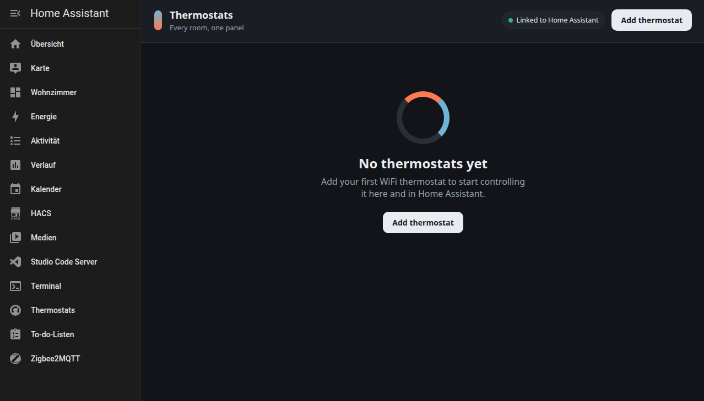

# WiFi Thermostat Manager — a Home Assistant add-on for Tuya & WiFi smart thermostats

Add, control and monitor **multiple WiFi smart thermostats from a single Home
Assistant dashboard**. Every thermostat you add is published to Home Assistant
as a native `climate` entity over **MQTT discovery**, so it appears
automatically with a full thermostat card and works in automations, scripts and
dashboards — not just inside this add-on.

Works with Tuya-based thermostats (Moes, Beca, Avatto, BHT-002, BAC-002 and
most white-label WiFi models) **locally over the LAN, with no cloud account**,
and with any thermostat exposing a local HTTP/JSON API.



## Features

- **One dashboard for every thermostat** — current temperature, setpoint, mode
  and heating/idle state on instrument-style dial cards.
- **Native Home Assistant climate entities** via MQTT discovery — no YAML,
  no template entities.
- **Local Tuya control** — talks straight to the device on port 6668, so it
  keeps working without internet.
- **Import from the Tuya integration** — pulls thermostats (with local keys, DP
  map and temperature scale) out of Home Assistant's official Tuya integration,
  so you never look up a local key by hand.
- **Two-way sync** — changes in Home Assistant reach the device, and changes
  made on the physical thermostat show up in Home Assistant.
- Add / edit / remove thermostats from the UI, with background polling keeping
  every device fresh.

## Supported thermostats

| Type | Use it for |
|------|------------|
| **Tuya (local)** | Moes, Beca, Avatto, BHT-002, BAC-002 and most cheap white-label WiFi thermostats. Controlled locally over the LAN — no cloud — using the device ID, local key and IP address. |
| **Tuya (cloud)** | The same devices when they are *not* reachable locally: cloud-only firmware, or when another client already holds the single local connection. Reuses the credentials Home Assistant's Tuya integration has already stored. |
| **Generic REST** | Any thermostat exposing a local HTTP/JSON API (custom, DIY or ESP-based firmware). Fully configurable URLs and JSON keys. |

Mains-powered thermostats (BHT/Beca/Moes floor and boiler units) work well
locally. **Battery radiator valves (TRVs) are usually cloud-only** — they sleep
and refuse local connections, so use the Tuya (cloud) type or Home Assistant's
native Tuya integration for those.

> The driver layer is pluggable — see [`app/thermostats/`](app/thermostats/) to
> add another protocol.

## Requirements

- Home Assistant OS or Supervised (this is an add-on).
- The **Mosquitto broker** add-on (or any MQTT broker) plus the Home Assistant
  **MQTT integration**. With Mosquitto installed the broker is auto-detected —
  no MQTT settings to fill in.

## Installation

1. In Home Assistant go to **Settings → Add-ons → Add-on Store**.
2. Open the **⋮** menu → **Repositories**, add this repository URL, and reload:
   ```
   https://github.com/pierrejochem/wifi-thermostat-manager
   ```
3. Install **WiFi Thermostat Manager**, then **Start** it.
4. Open the add-on's **Web UI** (it appears in the sidebar as *Thermostats*).

## Adding a Tuya thermostat

The fastest route is **Import from Home Assistant** in the dashboard: if the
official Tuya integration is already set up, your thermostats are added with
their local keys filled in automatically.

To add one by hand you need three things from the device, obtained once with
the standard `tinytuya wizard` flow or from the Tuya IoT platform:

- **Device ID**
- **Local key**
- **IP address** on your LAN

Click **Add thermostat**, choose *Tuya (local)*, fill those in and save. If
temperatures read doubled or halved, adjust the **temp scale divisor**
(BHT-style devices commonly use `2`).

## Adding a REST thermostat

Provide the status URL (returning JSON), the JSON keys for current/target
temperature and mode, and the command URLs. `{value}` and `{mode}` are
substituted at call time, e.g.
`http://192.168.1.50/api/setpoint?value={value}`.

## Documentation

Full configuration options, the MQTT topic layout and Tuya data-point mapping
are in [DOCS.md](DOCS.md).

## Notes

- Thermostat definitions persist in `/data` and survive restarts and updates.
- Tuya devices are controlled locally by default; the cloud driver is opt-in
  per device and only used when you pick the *Tuya (cloud)* type.

## Frontend development

The dashboard is a Vite + React + TypeScript app in [`frontend/`](frontend/).

```bash
# backend (Flask) on :8099
./dev/run-dev.sh
# frontend dev server on :5173 with HMR, proxies /api to Flask
cd frontend && npm install && npm run dev
```

The built bundle (`app/static/dist`) is **committed** so the add-on image does
not run a Node build on the device. After any UI change, rebuild and commit it:

```bash
cd frontend && npm run build      # writes app/static/dist
git add app/static/dist           # commit the refreshed bundle
```

## Support

This is provided as-is. Tuya data-point numbers vary between models — if a
device reports odd values, adjust the DP mapping in the stored definition (see
[DOCS.md](DOCS.md#tuya-data-points-advanced)).
